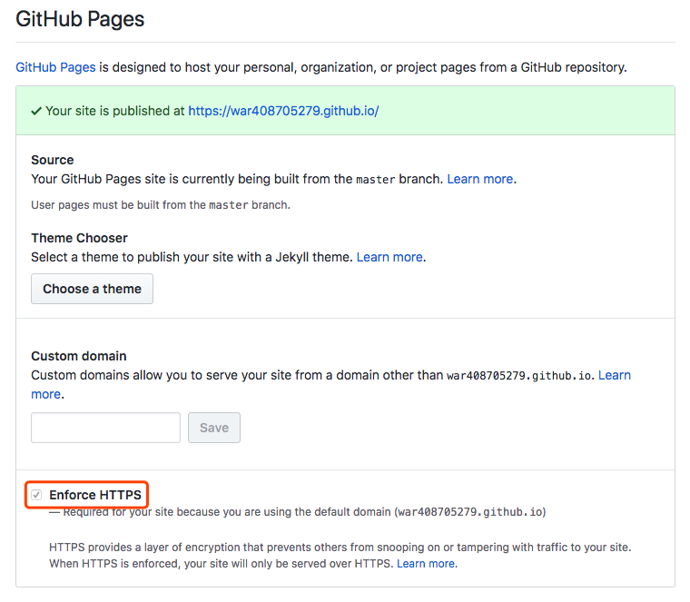

### Zhazha's blog

访问地址：https://war408705279.github.io

#### 如何使用 Git + Hugo 搭建属于自己的博客网站

平时在开发过程中多多少少会有一些积累，这个时候就想把这些积累写成博客，一是当做自己本身的沉淀，二是可以把这些积累分享出去

但是根据常规思路搭建一个属于自己的博客网站又太麻烦，这个时候可以使用 `Github + Hugo` 快速搭建一套属于自己的博客网站，下面就对搭建流程做一个简单的介绍

*注*：以下步骤以在 `macOS` 上的操作为例，其它操作系统类似，只是一些工具和命令有区别

#### 注册一个 Github 账号

首先你要有一个 `Github` 账号，这里就不赘述了，毕竟注册 `Github` 的流程不复杂

#### 创建一个 repo

新建一个 `GitHub repository`，库名为 `username.github.io`，`username` 即你的 `GitHub` 账号 `username`

例如我创建的 `repo` 就叫 `war408705279.github.io`

#### 安装 Hugo

`Hugo` 安装的官方文档 [传送门](https://gohugo.io/getting-started/installing/ "Hugo 安装的官方文档")

可以使用 `Homebrew` 进行快速的安装，命令如下

```shell
# 安装 hugo
brew install hugo

# 查看 hugo 版本信息
hugo version
```

#### 新建一个 Hugo 网站

`cd` 到你想保存 `Hugo` 网站的目录下，运行下面的命令

```shell
cd /code

hugo new site myblog
```

命令运行成功后会在当前目录（`/code`）下创建一个名为 `myblog` 的文件夹，里面保存着网站的初始文件。注意这里不用重复创建 `myblog` 文件夹

#### 选择 Hugo 主题并克隆至本地目录

`Hugo` 一个比较棒的功能是可以让用户自定义博客主题

官方获取 `themes` 主题的地址 [传送门](https://themes.gohugo.io "Hugo 官方主题")

目前我使用的主题是 `hello-friend-ng` [传送门](https://themes.gohugo.io/hugo-theme-hello-friend-ng/ "Hugo hello-friend-ng 主题")

将所选主题克隆至本地目录，运行下面的命令

```shell
# 进入网站目录，这个目录就是之前创建的那个目录
cd /code/myblog

# 在目录下创建 themes 文件夹
mkdir -p themes

# 进入 themes 目录
cd themes

# 将 hello-friend-ng 主题克隆至 hello-friend-ng 文件夹
git clone https://github.com/rhazdon/hugo-theme-hello-friend-ng.git hello-friend-ng
```

#### 编辑配置文件

现在准备工作就完成了，需要修改配置文件使主题生效，同时也可以通过配置文件自定义 `title`，目录 等

配置文件为 `/code/myblog` 目录下的 `config.toml` 文件

一般情况下，`Hugo` 主题页面中多会对该主题怎么进行配置予以说明

如果实在不知道怎么去配置，`git clone` 下来的 `themes` 代码里面有示例可以进行参考

类似我使用的主题，配置文件的示例就保存在 `/code/myblog/themes/hello-friend-ng/exampleSite/config.toml` 文件中

下面这段配置是我目前正在使用的配置

```toml
baseURL = "https://war408705279.github.io"
title   = "rm -rf *"

DefaultContentLanguage = "en"

theme = "hello-friend-ng"

pygmentsCodefences = true
pygmentsUseClasses = true
rssLimit  = 10  # Maximum number of items in the RSS feed.
copyright = "This work is licensed under a Creative Commons Attribution-NonCommercial 4.0 International License." # This message is only used by the RSS template.

# googleAnalytics = ""
# disqusShortname = ""

archetypeDir = "archetypes"
contentDir   = "content"
dataDir      = "data"
layoutDir    = "layouts"
publishDir   = "public"

buildDrafts  = false
buildFuture  = false
buildExpored = false
canonifyURLs = true

enableRobotsTXT = true
enableGitInfo   = false
enableEmoji     = true
enableMissingTranslationPlaceholders = false
disableRSS     = false
disableSitemap = false
disable404     = false
disableHugoGeneratorInject = false

[permalinks]
  posts = "/posts/:year/:month/:title/"

[author]
  name = "Zhazha"

[blackfriday]
  hrefTargetBlank = true

[taxonomies]
  tag      = "tags"
  category = ""

[params]
  dateform        = "Jan 2, 2006"
  dateformShort   = "Jan 2"
  dateformNum     = "2006-01-02"
  dateformNumTime = "2006-01-02 15:04 +0800"

  # Metadata mostly used in document's head
  description = "This is a blog belongs to Zhazha"
  keywords = "HTML5, Javascript, css, front-end, blog"
  images = [""]

  homeSubtitle = "人生漫长我劝你好生走路"

  # Prefix of link to the git commit detail page. GitInfo must be enabled.
  # gitUrl = ""

  # Integrate Javascript files or stylesheets by adding the url to the external assets or by
  # linking local files with their path relative to the static folder, e.g. "css/styles.css"
  customCSS = []
  customJS  = []

  # Toggle this option need to rebuild SCSS, requires extended version of Hugo
  justifyContent = false  # Set "text-align: justify" to .content.

  # Directory name of your blog content (default is `content/posts`)
  contentTypeName = "blogs"
  # Default theme "light" or "dark"
  defaultTheme = "dark"

  [params.logo]
    logoText     = "简眸。"
    logoHomeLink = "/"

  # Social icons

  [[params.social]]
    name = "email"
    url  = "mailto:jiayizhen@qiniu.com"

  [[params.social]]
    name = "github"
    url  = "https://github.com/war408705279/"

[languages]
  [languages.en]
    subtitle  = "人生漫长我劝你好生走路"
    weight    = 1
    copyright = '<a href="https://github.com/war408705279/" target="_blank" rel="noopener">404 Not Found</a>'

[menu]
  [[menu.main]]
    identifier = "blogs"
    name       = "博客"
    url        = "blogs/"
    weight     = 9
  [[menu.main]]
    identifier = "travel"
    name       = "游记"
    url        = "travel/"
    weight     = 10
```

#### 新建一篇文章

进入网站文件夹的根目录

```shell
cd /code/myblog
```

使用以下命令新建一篇文章

```shell
hugo new blogs/blog-test.md
```

运行上述命令后，会在 `/code/myblog/content` 目录下面创建一个 `blogs` 文件夹

并在该文件夹中创建 `blog-test.md` 文件

在后续创建文章的过程中，要注意路径和文件命名的问题，避免重复创建、路径错误等问题

编辑新建的文章，添加内容并保存

#### 本地预览网站效果

在本地启动 `Hugo server`

```shell
cd /code/myblog

hugo server -D
```

可以看到本地服务启在 http://localhost:1313

如果你对编辑的结果满意，就可以准备发布了

如果不满意，可以继续对 `config.toml` 文件或你创建 `md` 的文件进行编辑

本地的 `hugo server` 是热更新的，每次你保存后就会自动更新

#### 构建 Hugo 网站

运行下面的命令在本地构建 `Hugo` 网站

```shell
cd /code/myblog

hugo
```

本地构建成功后，生成的文件保存在 `/code/myblog/public` 文件夹中，包含 `html、css、js、图片文件`等

#### 将网站文件夹转换为 Git 库

下面就是将本地目录和 `Git` 远程库关联起来

```shell
# 生成的 hugo 站点文件保存在 public 目录中，需要将 public 文件夹转换为 Git 库
cd /code/myblog/public

# 初始化 Git 库
git init

# 将本地目录和 Git 远程仓库关联
git remote add origin git@github.com:war408705279/war408705279.github.io.git
```

#### 将修改推至远程库

关联成功后，会看到本地 `Git` 库和远程的 `Git` 仓库有差异，需要将修改推送到远程的 `Git` 仓库，运行下面的命令

```shell
git add .
git commit -m 'commit message'
git push origin master
```

推送成功后，你的 `blog` 网站就创建成功了，可以通过下面的链接访问

```shell
# 把 war408705279.github.io 这部分换成你的 Git repo 名字就可以了
https://war408705279.github.io
```

如果想使用 `HTTPS` 以防止其他人窥探或篡改网站流量，在 `GitHub` 上打开相应的库，点击 `Settings` 勾选 `Enforce HTTPS` 即可，如下图所示



#### 后续

如果你想修改博客文章，或者增加新的博客文章，只需要重复下面几步就可以了

- 新建一篇文章，编辑内容
- 本地预览网站呈现效果
- 构建 `Hugo` 网站
- 提交修改至 `Git` 本地库
- 将修改推至远程库

#### Tips

构建博客网站过程中遇到的一些问题 [传送门](./Hugo-Tips.md "构建博客网站过程中遇到的一些问题")

#### Live Long And Prosper
